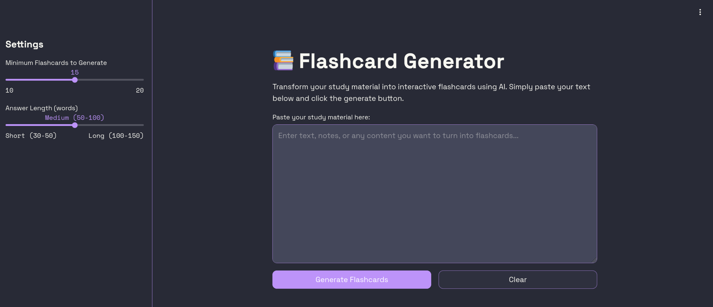

# Flashcard Generator with Cerebras AI


An interactive web application that generates educational flashcards from text input using Llama 4 Scout language model using Cerebras API.

## Features

- 🚀 Generate flashcards from any text content
- 🎚️ Adjustable flashcard count (10-20 cards)
- 📏 Customizable answer length (Short, Medium, Long)
- 🔄 Toggle between original and reversed order
- 👁️ Show/hide all answers with one click
- 📥 Download flashcards as JSON, CSV

## Prerequisites

- Python 3.8+
- Cerebras API key
- Streamlit
- python-dotenv

## Installation

1. Clone the repository:
   ```bash
   git clone https://github.com/yourusername/flashcard-generator.git
   cd flashcard-generator
   ```

2. Create and activate a virtual environment:
   ```bash
   python -m venv .venv
   source .venv/bin/activate  # On Windows use `venv\Scripts\activate`
   ```

3. Install dependencies
   ```bash
   pip install -r requirements.txt
   ```

4. Create a .env file in the project root with your API key:
   ```bash
   API_KEY = 'your_cerebras_api_key_here'
   ```

## Deploying on StreamLit Community Cloud

1. Fork the repository

2. Login to Streamlit Cloud Dashboard

3. Deploy the app from the repository

4. Set `API_KEY` under App Settings > Secrets:
   ```bash
   API_KEY = 'your_cerebras_api_key_here'
   ```
## Usage

1. Run the application:
   ```bash
   streamlit run app.py
   ```

2. In your browser:
    - Paste your study material in the text area

    - Adjust settings in the sidebar if needed

    - Click "Generate Flashcards"

    - Use the toggles to control display options

    - Download the flashcards when ready

## Configuration

Customize the application through the sidebar:
  - Minimum Flashcards: Set how many cards to generate (10-20)
  - Answer Length: Choose between Short, Medium, or Long answers


## Screenshot

 

## Sample
### Input:
Cloud services are considered "public" when they are delivered over the public Internet, and they may be offered as a paid subscription, or free of charge. Architecturally, there are few differences between public- and private-cloud services, but security concerns increase substantially when services (applications, storage, and other resources) are shared by multiple customers. Most public-cloud providers offer direct-connection services that allow customers to securely link their legacy data centers to their cloud-resident applications. Several factors like the functionality of the solutions, cost, integrational and organizational aspects as well as safety & security are influencing the decision of enterprises and organizations to choose a public cloud or on-premises solution.

### Output:

[Raw File](docs/flashcards.json)

```yaml
[
  {
    "Question": "What makes cloud services public?",
    "Answer": "Cloud services are considered public when delivered over the public Internet, and may be offered as a paid subscription or free of charge."
  },
  {
    "Question": "What are the main differences between public and private cloud services?",
    "Answer": "There are few architectural differences between public and private cloud services, but security concerns increase substantially when services are shared by multiple customers in public clouds."
  },
  {
    "Question": "How do public cloud providers address security concerns?",
    "Answer": "Most public cloud providers offer direct-connection services that allow customers to securely link their legacy data centers to their cloud-resident applications."
  },
  ...
]
```
